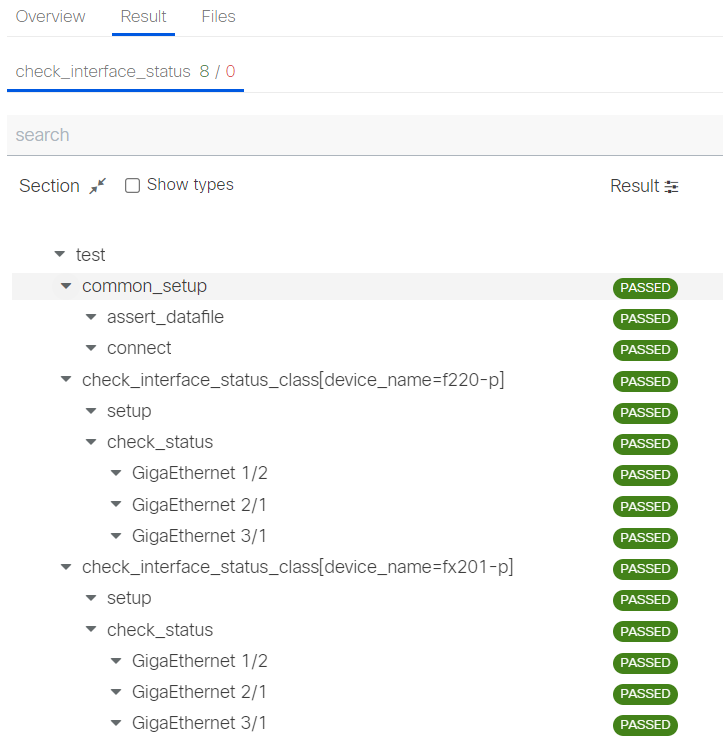
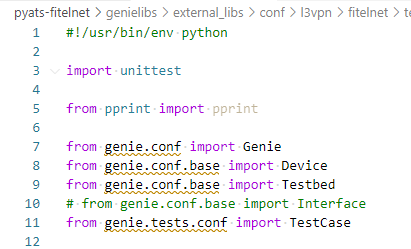
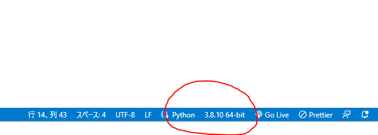

# PyATS for FITELnet

FITELnet機器をPyATSで利用するためのUniconプラグインとGenieパーサー、Genie confライブラリ、および動作させるサンプルスクリプトです。

<br><br>

## 環境構築の準備

pyATSを利用するために必要な環境を準備します。

必要なもの

- Linux (Windows + WSLで可)
- Python3
- direnv
- Git環境
- このリポジトリ

<br>

> **Note**
>
> Windows + WSLの構成でVPNも同時に使う場合は、WSL version 2ではなく、WSL version 1を使うようにしてください。

<br>

> **Note**
>
> このリポジトリは下記組み合わせで動作しています。
> - WSL version 1
> - Ubuntu 20.04
> - Python 3.8


<br>

## このリポジトリの使い方

環境構築の流れはこうなります。

0. direnvをインストール(sudo apt install direnv)
1. リポジトリをクローン(git clone)
2. venvでPython環境を作成(python3 -m venv .venv)
3. direnvを設定(direnv allow)
4. Pythonモジュールをインストール(pip install -r requirements.txt)
5. Uniconプラグインをインストール(make develop)
6. Visual Studio Codeを設定

<br>

### 0. direnvをインストール

すでにインストールしてあれば不要です。

```bash
sudo apt install direnv
```

ログインシェルがbashであれば~/.bashrcに下記を追記します。

```bash
## direnv
eval "$(direnv hook bash)"
```

bash以外のシェルはこちらのページを参照してください。

https://github.com/direnv/direnv/blob/master/docs/hook.md

<br>

### 1. このリポジトリをクローン

git cloneコマンドでクローンしてください。

<br>

### 2. venvでPython環境を作成

pyats-fitelnetディレクトリができますので、そこに移動してPython仮想環境を作ります。

```bash
cd pyats-fitelnet

/usr/bin/python3 -m venv .venv
```

<br>

### 3. direnvを設定

venvで作成した環境を有効にするには `source .venv/bin/activate` コマンドを実行するわけですが、direnvを使うことでその作業を省略できます。

このリポジトリには.envrcが含まれていますので、内容を確認して問題なければ `direnv allow` を実行して有効にします。

- .envrc

```bash
source .venv/bin/activate
unset PS1

# PYTHONPATH
export PYTHONPATH=$PWD/genieparser:$PWD/genielibs:$PYTHONPATH

# pyATS external genie parser
export PYATS_LIBS_EXTERNAL_PARSER=external_parser
```

<br>

### 4. Pythonモジュールをインストール

Python仮想環境を有効にしたらpyATSをインストールします。

```bash
pip install pyats[full]
```

としてもよいのですが、他にも利用するものがありますのでrequirements.txtでまとめてインストールします（おすすめ）。

```bash
pip install -r requirements.txt
```

これで pyats-fitelnet ディレクトリ配下にいる間はpyatsが利用できます。

<br>

### 5. Uniconプラグインをインストール

続いてFITELnet機器に接続するための**Uniconプラグインをインストール**します（ソースコードを配置しただけでは利用できません）。

unicon.pluginsディレクトリにソースコードがありますので、ディレクトリを移動します。

```bash
cd unicon.plugins
```

make developコマンドでインストールします。

```bash
make develop
```

makeコマンドがなければ次のようにsetup.pyスクリプトを実行します。

```bash
python setup.py develop --no-deps
```

実行例です。

```bash
iida@FCCLS0008993-00:~/git/pyats-fitelnet/unicon.plugins$ make develop

--------------------------------------------------------------------
Building and installing unicon.plugins.fitelnet development distributable: develop

WARNING: Skipping unicon.plugins.fitelnet as it is not installed.
running develop
running egg_info
creating src/unicon.plugins.fitelnet.egg-info
writing src/unicon.plugins.fitelnet.egg-info/PKG-INFO
writing dependency_links to src/unicon.plugins.fitelnet.egg-info/dependency_links.txt
writing entry points to src/unicon.plugins.fitelnet.egg-info/entry_points.txt
writing requirements to src/unicon.plugins.fitelnet.egg-info/requires.txt
writing top-level names to src/unicon.plugins.fitelnet.egg-info/top_level.txt
writing manifest file 'src/unicon.plugins.fitelnet.egg-info/SOURCES.txt'
reading manifest file 'src/unicon.plugins.fitelnet.egg-info/SOURCES.txt'
writing manifest file 'src/unicon.plugins.fitelnet.egg-info/SOURCES.txt'
running build_ext
Creating /home/iida/git/pyats-fitelnet/.venv/lib/python3.8/site-packages/unicon.plugins.fitelnet.egg-link (link to src)
Adding unicon.plugins.fitelnet 1.0 to easy-install.pth file

Installed /home/iida/git/pyats-fitelnet/unicon.plugins/src

Completed building and installing: develop

Done.
```

unicon.plugins/srcディレクトリにegg-infoが作られています。
何らかの理由でこのPython環境からプラグインを取り除きたくなったときにegg-infoは必要ですので、消さないようにしておきます。

正しくインストールされたかpip listコマンドで確認できます。

```bash
unicon                       22.11
unicon-plugins-fitelnet      1.0         /home/iida/git/pyats-fitelnet/unicon.plugins/src
unicon.plugins               22.11
```

これでpyATSを使ってFITELnetの機器に接続できるようになります。

<br>

### 6.Visual Studio Codeを設定

続いてVisual Studio Codeに設定を加えます。

GenieパーサーとGenieライブラリをスクリプトの中で直接呼び出して使うのであればVisual Studio Codeの補完機能がないと開発効率が悪くなります。

vscodeの設定メニューからextra pathsを検索します。

ワークスペースに限定して、以下の設定になるようにパスを追加します。

```json
{
    "folders": [
        {
            "path": "."
        }
    ],
    "settings": {
        "python.analysis.extraPaths": [
            "genieparser",
            "genielibs",
        ]
    }
}
```

これで補完が効くようになります。

「ファイル」→「名前をつけてワークスペースを保存」を選択して、ワークスペースをファイル名で保存します。

次回以降は「ファイルでワークスペースを開く」を使ってワークスペースを開きます。

<br>

## Ubuntu 22.04 LTSをお使いの方

[こちら](README.Ubuntu22.md)も参照してください。


<br>

## モックデバイスを使って試してみる

構築した環境で期待通りに動作するかをモックデバイスで確認してみます。

6台のFITELnetルータのインタフェースが期待通りリンクアップしているかを確認するテストを実行します。

```bash
./examples/check_interface_status/run -m
```

> **Note**
>
> 初回起動時は若干遅いです。

```bash
iida@FCCLS0008993-00:~/git/pyats-fitelnet$ examples/check_interface_status/run -m
run using mock devices
2022-12-27T10:21:31: %EASYPY-INFO: Starting job run: job
2022-12-27T10:21:31: %EASYPY-INFO: Runinfo directory: /home/iida/.pyats/runinfo/job.2022Dec27_10:21:30.552528
2022-12-27T10:21:31: %EASYPY-INFO: --------------------------------------------------------------------------------
2022-12-27T10:21:39: %EASYPY-INFO: +------------------------------------------------------------------------------+
2022-12-27T10:21:39: %EASYPY-INFO: |                              Clean Information                               |
2022-12-27T10:21:39: %EASYPY-INFO: +------------------------------------------------------------------------------+

...途中省略...

2022-12-27T10:22:37: %EASYPY-INFO: +------------------------------------------------------------------------------+
2022-12-27T10:22:37: %EASYPY-INFO: |                             Task Result Summary                              |
2022-12-27T10:22:37: %EASYPY-INFO: +------------------------------------------------------------------------------+
2022-12-27T10:22:37: %EASYPY-INFO: check_interface_status: test.common_setup                                 PASSED
2022-12-27T10:22:37: %EASYPY-INFO: check_interface_status: test.check_interface_status_class[device_na...    PASSED
2022-12-27T10:22:37: %EASYPY-INFO: check_interface_status: test.check_interface_status_class[device_na...    PASSED
2022-12-27T10:22:37: %EASYPY-INFO: check_interface_status: test.check_interface_status_class[device_na...    PASSED
2022-12-27T10:22:37: %EASYPY-INFO: check_interface_status: test.check_interface_status_class[device_na...    PASSED
2022-12-27T10:22:37: %EASYPY-INFO: check_interface_status: test.check_interface_status_class[device_na...    PASSED
2022-12-27T10:22:37: %EASYPY-INFO: check_interface_status: test.check_interface_status_class[device_na...    PASSED
2022-12-27T10:22:37: %EASYPY-INFO: check_interface_status: test.common_cleanup                               PASSED
2022-12-27T10:22:37: %EASYPY-INFO:
2022-12-27T10:22:37: %EASYPY-INFO: +------------------------------------------------------------------------------+
2022-12-27T10:22:37: %EASYPY-INFO: |                             Task Result Details                              |
2022-12-27T10:22:37: %EASYPY-INFO: +------------------------------------------------------------------------------+
2022-12-27T10:22:37: %EASYPY-INFO: check_interface_status: test
2022-12-27T10:22:37: %EASYPY-INFO: |-- common_setup                                                          PASSED
2022-12-27T10:22:37: %EASYPY-INFO: |   |-- assert_datafile                                                   PASSED
2022-12-27T10:22:37: %EASYPY-INFO: |   `-- connect                                                           PASSED
2022-12-27T10:22:37: %EASYPY-INFO: |-- check_interface_status_class[device_name=f220-p]                      PASSED
2022-12-27T10:22:37: %EASYPY-INFO: |   |-- setup                                                             PASSED
2022-12-27T10:22:37: %EASYPY-INFO: |   `-- check_status                                                      PASSED
2022-12-27T10:22:37: %EASYPY-INFO: |       |-- STEP 1: GigaEthernet 1/2                                      PASSED
2022-12-27T10:22:37: %EASYPY-INFO: |       |-- STEP 2: GigaEthernet 2/1                                      PASSED
2022-12-27T10:22:37: %EASYPY-INFO: |       `-- STEP 3: GigaEthernet 3/1                                      PASSED
2022-12-27T10:22:37: %EASYPY-INFO: |-- check_interface_status_class[device_name=fx201-p]                     PASSED
2022-12-27T10:22:37: %EASYPY-INFO: |   |-- setup                                                             PASSED
2022-12-27T10:22:37: %EASYPY-INFO: |   `-- check_status                                                      PASSED
2022-12-27T10:22:37: %EASYPY-INFO: |       |-- STEP 1: GigaEthernet 1/2                                      PASSED
2022-12-27T10:22:37: %EASYPY-INFO: |       |-- STEP 2: GigaEthernet 2/1                                      PASSED
2022-12-27T10:22:37: %EASYPY-INFO: |       `-- STEP 3: GigaEthernet 3/1                                      PASSED
2022-12-27T10:22:37: %EASYPY-INFO: |-- check_interface_status_class[device_name=fx201-pe1]                   PASSED
2022-12-27T10:22:37: %EASYPY-INFO: |   |-- setup                                                             PASSED
2022-12-27T10:22:37: %EASYPY-INFO: |   `-- check_status                                                      PASSED
2022-12-27T10:22:37: %EASYPY-INFO: |       |-- STEP 1: GigaEthernet 1/1                                      PASSED
2022-12-27T10:22:37: %EASYPY-INFO: |       |-- STEP 2: GigaEthernet 3/1                                      PASSED
2022-12-27T10:22:37: %EASYPY-INFO: |       |-- STEP 3: GigaEthernet 2/1.1                                    PASSED
2022-12-27T10:22:37: %EASYPY-INFO: |       `-- STEP 4: GigaEthernet 2/1.2                                    PASSED
2022-12-27T10:22:37: %EASYPY-INFO: |-- check_interface_status_class[device_name=f220-pe2]                    PASSED
2022-12-27T10:22:37: %EASYPY-INFO: |   |-- setup                                                             PASSED
2022-12-27T10:22:37: %EASYPY-INFO: |   `-- check_status                                                      PASSED
2022-12-27T10:22:37: %EASYPY-INFO: |       |-- STEP 1: GigaEthernet 1/1                                      PASSED
2022-12-27T10:22:37: %EASYPY-INFO: |       |-- STEP 2: GigaEthernet 1/2                                      PASSED
2022-12-27T10:22:37: %EASYPY-INFO: |       |-- STEP 3: GigaEthernet 2/1.1                                    PASSED
2022-12-27T10:22:37: %EASYPY-INFO: |       `-- STEP 4: GigaEthernet 2/1.2                                    PASSED
2022-12-27T10:22:37: %EASYPY-INFO: |-- check_interface_status_class[device_name=f221-ce1]                    PASSED
2022-12-27T10:22:37: %EASYPY-INFO: |   |-- setup                                                             PASSED
2022-12-27T10:22:37: %EASYPY-INFO: |   `-- check_status                                                      PASSED
2022-12-27T10:22:37: %EASYPY-INFO: |       |-- STEP 1: GigaEthernet 2/1.1                                    PASSED
2022-12-27T10:22:37: %EASYPY-INFO: |       `-- STEP 2: GigaEthernet 2/1.2                                    PASSED
2022-12-27T10:22:37: %EASYPY-INFO: |-- check_interface_status_class[device_name=f221-ce2]                    PASSED
2022-12-27T10:22:37: %EASYPY-INFO: |   |-- setup                                                             PASSED
2022-12-27T10:22:37: %EASYPY-INFO: |   `-- check_status                                                      PASSED
2022-12-27T10:22:37: %EASYPY-INFO: |       |-- STEP 1: GigaEthernet 2/1.1                                    PASSED
2022-12-27T10:22:37: %EASYPY-INFO: |       `-- STEP 2: GigaEthernet 2/1.2                                    PASSED
2022-12-27T10:22:37: %EASYPY-INFO: `-- common_cleanup                                                        PASSED
2022-12-27T10:22:37: %EASYPY-INFO:     `-- disconnect                                                        PASSED
2022-12-27T10:22:37: %EASYPY-INFO: Sending report email...
2022-12-27T10:22:37: %EASYPY-INFO: Missing SMTP server configuration, or failed to reach/authenticate/send mail. Result notification email failed to send.
2022-12-27T10:22:38: %EASYPY-INFO: Done!

Pro Tip
-------
   Try the following command to view your logs:
       pyats logs view
```

最後に出力されている通り `pyats logs view` を実行するとブラウザでテスト結果を確認できます。

このような画面が出れば成功です。




他にもモックデバイスで動作するテストがありますので、実行してどのようにログ表示されるか確認してみるとよいでしょう。

- CEルータ間でpingが通ることを確認するテスト

```bash
./examples/check_ping_ce/run -m
```

- コアルータ間でpingが通ることを確認するテスト

```bash
./examples/check_ping_core/run -m
```

- SRv6 SIDが期待通り網内に存在することを確認するテスト

```bash
./examples/check_segment_list/run -m
```

<br><br>

## 自分でスクリプトを書きたい場合

単体で動作するスクリプトは [examples/bin/test-script.py](examples/bin/test-script.py) を参照してください。

一連の動作をスクリプト化したい場合は examplesディレクトリにあるcheck_で始まるテストを参照してください。

<br><br>

## うまくいかないとき

PYTHONPATHで設定したパスが次のようにsys.pathに反映されているか、確認しましょう。

```python
iida@FCCLS0008993-00:~/git/pyats-fitelnet$ python -m site
sys.path = [
    '/home/iida/git/pyats-fitelnet',
    '/home/iida/git/pyats-fitelnet/genieparser',
    '/home/iida/git/pyats-fitelnet/genielibs',
    '/usr/lib/python38.zip',
    '/usr/lib/python3.8',
    '/usr/lib/python3.8/lib-dynload',
    '/home/iida/git/pyats-fitelnet/.venv/lib/python3.8/site-packages',
    '/home/iida/git/pyats-fitelnet/unicon.plugins/src',
]
USER_BASE: '/home/iida/.local' (exists)
USER_SITE: '/home/iida/.local/lib/python3.8/site-packages' (exists)
ENABLE_USER_SITE: False
```

pipでインストールした外部ライブラリがvscodeで認識されない場合。
このようにvscodeでみたときに波線が出てしまうことがあります。



このようなときは、vscodeが認識しているPythonが何かを確認しましょう。
画面右下に注目。



ここがグローバルにインストールされているPython環境だとよろしくありません。
'python -m venv <dirname>'で作成した仮想環境でなければいけません。

基本的にvscodeは自動でvenvの環境を見つけてくれるのですが、グローバルのPython環境が選ばれてしまうことも発生しうることです。

> **Note**
>
> Where the extension looks for environments
> https://code.visualstudio.com/docs/python/environments#_where-the-extension-looks-for-environments

settings.jsonに以下を入れておくとよいかもしれません。

```javascript
    "python.venvFolders": [
        "envs",
        ".venv",
        ".pyenv",
        ".direnv"
    ],
```

<br><br><br><br>

# FITELnetメモ

F220のマニュアル一式はこちらからダウンロードできます。

https://www.furukawa.co.jp/fitelnet/product/f220/manual/index.html

<br><br>

## boot.cfgとcurrent.cfgとworking.cfg

この図を頭に入れておきます。


working.cfg = candidate-config

current.cfg = running-config

boot.cfg = startup-config

commit = refresh

discard = restore

config terminalで入るのは working.cfg = candidate-config です。これはわかりやすいです。

saveコマンドはworking.cfg = candidate-config を書き出すコマンドなので、これは注意が必要です（running-configが保存されるわけではない）。

running-configを保存するのであれば、commitしてからsave、もしくはrestore boot.cfgを実行します（あまり自信ない・・・）。


<br>

## 設定の初期化

何も設定されていない状態から設定するにはこのコマンドを使います。

clear candidate-config = clear working.cfg

初期化されるのはあくまで編集用のコンフィグなので、この状態で起動したければsaveしてから再起動します。

commitして反映するとSSHの接続がどうなるのかわからないので、怖くて試していません。どうなるんだろう？

<br>

## 起動時のコンフィグの指定

設定ではなく、指定です。

boot configuration <ファイル名>

で起動するファイルを指定します。

<br>

## 工場出荷状態に戻す

reset clear

を実行すると工場出荷状態で起動します。

これを実際にやってしまうとSSHで接続できなくなるので、試してません。

<br>

## メモリ使用量の把握

show buffer もしくは show processes memoryを使う。

show memory というコマンドもあるが、これはモジュール内部のリソースを表示するものなので、見てもよくわからない。

<br>

## disconnect

残ってしまったSSHを切断する場合はこうします。

```bash
fx201-pe1#show ssh

Connection  Version  Encryption   State              Username         Line
0           1.5      none         Session initiating
1           1.5      none         Session initiating
2           2.0      AES128-CTR   Session started    user             /dev/pts/0
3           2.0      AES128-CTR   Session started    user             /dev/pts/1
4           2.0      AES128-CTR   Session started    user             /dev/pts/2

fx201-pe1#
fx201-pe1#disconnect ssh 2
Disconnect OK?[y/N]:yes

fx201-pe1#
```

<!--
総じて使いやすいが、save/restore/load等、遷移図を頭に入れておかないと操作を間違えそうなので、これはマニュアルの先頭に書くべき。
操作方法を一枚にまとめたシートがあるとよい。
-->

<br><br><br>

# 複数のルータを一括操作

ルータが複数あるときは、スクリプトで一括操作した方が効率的です。

操作する対象を指定するには '--group <グループ名>' もしくは '--host <ホスト名>' を指定します。

```python
    router_groups = {
        'p': ['fx201-p', 'f220-p'],
        'pe': ['fx201-pe1', 'f220-pe2'],
        'ce': ['f221-ce1', 'f221-ce2'],
        'core': ['fx201-p', 'f220-p', 'fx201-pe1', 'f220-pe2'],
        'all': ['fx201-p', 'f220-p', 'fx201-pe1', 'f220-pe2', 'f221-ce1', 'f221-ce2']
    }
```

--group all がデフォルトです。

<br><br>

## 編集中の設定を破棄する

FITELnetのコマンドはrestoreです。

working.cfgをcurrent.cfgの内容で復元します（つまり、現在のworking.cfgの編集内容を破棄して動作中の設定に戻すことになります）。

一括で操作するスクリプトは `examples/bin/restore.py -y` です。

デフォルトの対象装置は '--group all' です。

実行例。

```bash
iida@FCCLS0008993-00:~/git/pyats-fitelnet$ ./examples/bin/restore.py -y

（省略）

| device    | result   |
|-----------|----------|
| fx201-p   | Success  |
| f220-p    | Success  |
| fx201-pe1 | Success  |
| f220-pe2  | Success  |
| f221-ce1  | Success  |
| f221-ce2  | Success  |
```

<br><br>

## 動作中の設定をファイルに保存する

FITELnetのコマンドはrestore <filename>です。

今動いている設定(current.cfg)をファイルに保存します。

一括で操作するスクリプトは `examples/bin/restore.py --filename <filename> -y` です。

デフォルトの対象装置は '--group all' です。

実行例。

```bash
iida@FCCLS0008993-00:~/git/pyats-fitelnet$ ./examples/bin/restore.py --filename /drive/config/iida.cfg -y

（省略）

| device    | result   |
|-----------|----------|
| fx201-p   | Success  |
| f220-p    | Success  |
| fx201-pe1 | Success  |
| f220-pe2  | Success  |
| f221-ce1  | Success  |
| f221-ce2  | Success  |
```

<br><br>

## 編集中の設定をboot.cfgとして保存する

FITELnetのコマンドはsaveです。

今編集している設定(working.cfg)を起動用の設定(boot.cfg)として保存します。

一括で操作するスクリプトは `examples/bin/save.py -y` です。

デフォルトの対象装置は '--group all' です。

実行例。

> **Warning**
>
> この作業は慎重に実行しましょう。commitして動作することを確認した後の方がよろしいかと思います。

```bash
iida@FCCLS0008993-00:~/git/pyats-fitelnet$ ./examples/bin/save.py -y

（省略）

| device    | result   |
|-----------|----------|
| fx201-p   | Success  |
| f220-p    | Success  |
| fx201-pe1 | Success  |
| f220-pe2  | Success  |
| f221-ce1  | Success  |
| f221-ce2  | Success  |
```

<br><br>

## 編集中の設定を装置内に保存する

FITELnetのコマンドはsave <filename>です。

今編集している設定(working.cfg)をファイルとして保存します。

一括で操作するスクリプトは `examples/bin/save.py --filename <filename> -y` です。

デフォルトの対象装置は '--group all' です。

実行例。

```bash
iida@FCCLS0008993-00:~/git/pyats-fitelnet$ ./examples/bin/save.py --filename /drive/config/iida.cfg -y

（省略）

| device    | result   |
|-----------|----------|
| fx201-p   | Success  |
| f220-p    | Success  |
| fx201-pe1 | Success  |
| f220-pe2  | Success  |
| f221-ce1  | Success  |
| f221-ce2  | Success  |
```

<br><br>

## 編集中の設定を運用中の設定に反映させる

FITELnetのコマンドはrefreshです。commitと同じ動作です。

今編集している設定(working.cfg)を運用中の設定に反映させます。

一括で操作するスクリプトは `examples/bin/refresh.py -y` です。

デフォルトの対象装置は '--group all' です。

実行例。

```bash
iida@FCCLS0008993-00:~/git/pyats-fitelnet$ ./examples/bin/refresh.py -y

（省略）

| device    | result   |
|-----------|----------|
| fx201-p   | Success  |
| f220-p    | Success  |
| fx201-pe1 | Success  |
| f220-pe2  | Success  |
| f221-ce1  | Success  |
| f221-ce2  | Success  |
```

<br><br>

## ファイルの内容を運用中の設定に反映させる

FITELnetのコマンドはrefresh <filename>です。

ファイルに保存されている設定を運用中の設定に反映させます。

一括で操作するスクリプトは `examples/bin/refresh.py --filename <filename> -y` です。

デフォルトの対象装置は '--group all' です。

> **Note**
>
> ファイル名はフルパスで指定してください。

実行例。

```bash
iida@FCCLS0008993-00:~/git/pyats-fitelnet$ ./examples/bin/refresh.py /drive/config/boot.cfg -y

（省略）

| device    | result   |
|-----------|----------|
| fx201-p   | Success  |
| f220-p    | Success  |
| fx201-pe1 | Success  |
| f220-pe2  | Success  |
| f221-ce1  | Success  |
| f221-ce2  | Success  |
```

<br><br>

## ファイルから編集用の設定を読み込む

FITELnetのコマンドはloadです。

引数を指定しない場合はboot.cfgを読み込んで編集用設定に反映させます。

一括で操作するスクリプトは `examples/bin/load.py --filename <filename> -y` です。

デフォルトの対象装置は '--group all' です。

実行例。

```bash
iida@FCCLS0008993-00:~/git/pyats-fitelnet$ ./examples/bin/load.py -y

（省略）

| device    | result   |
|-----------|----------|
| fx201-p   | Success  |
| f220-p    | Success  |
| fx201-pe1 | Success  |
| f220-pe2  | Success  |
| f221-ce1  | Success  |
| f221-ce2  | Success  |
```

<br><br>

## ファイル一覧を表示する

FITELnetのコマンドはdir <directory>です。

一括で操作するスクリプトは `examples/bin/dir.py --dirname <dirname> -y` です。

デフォルトの対象装置は '--group all' です。

実行例。

```bash
iida@FCCLS0008993-00:~/git/pyats-fitelnet$ ./examples/bin/dir.py --dirname /drive/config -y

（省略）

fx201-p
| filename                 |   length | date         |
|--------------------------|----------|--------------|
| boot.cfg                 |     1249 | Jan  2 11:32 |
| fx201p-srv6-flexalgo.cfg |     1375 | Nov 16 14:47 |
| fx201p-srv6-l2vpn.cfg    |      887 | Nov 16 16:30 |
| fx201p-srv6-l3vpn.cfg    |      881 | Nov 16 15:28 |
| fx201p-srv6-static.cfg   |     1021 | Nov 15 21:02 |
| iida.cfg                 |     1249 | Jan  2 11:36 |

f220-p
| filename                |   length | date         |
|-------------------------|----------|--------------|
| boot.cfg                |     1367 | Jan  2 11:32 |
| f220p-srv6-flexalgo.cfg |     1530 | Nov 16 14:47 |
| f220p-srv6-l2vpn.cfg    |     1083 | Nov 16 16:30 |
| f220p-srv6-l3vpn.cfg    |     1077 | Nov 16 15:28 |
| f220p-srv6-static.cfg   |     1140 | Nov 15 21:02 |
| iida.cfg                |     1367 | Jan  2 11:36 |

（省略）
```

<br><br>

## ファイルを削除する

FITELnetのコマンドはdelete <filename>です。

一括で操作するスクリプトは `examples/bin/delete.py --filename <filename> -y` です。

デフォルトの対象装置は '--group all' です。

実行例。

```bash
iida@FCCLS0008993-00:~/git/pyats-fitelnet$ examples/bin/delete.py --filename /drive/config/iida.cfg -y

（省略）

| device    | result   | output   |
|-----------|----------|----------|
| fx201-p   | Success  |          |
| f220-p    | Success  |          |
| fx201-pe1 | Success  |          |
| f220-pe2  | Success  |          |
| f221-ce1  | Success  |          |
| f221-ce2  | Success  |          |
```

存在しないファイルを消そうとして失敗した場合はこのように表示されます。

```bash
| device    | result   | output                                                                |
|-----------|----------|-----------------------------------------------------------------------|
| fx201-p   | Fail     | rm: cannot remove '/drive/config/iida.cfg': No such file or directory |
| f220-p    | Fail     | rm: cannot remove '/drive/config/iida.cfg': No such file or directory |
| fx201-pe1 | Fail     | rm: cannot remove '/drive/config/iida.cfg': No such file or directory |
| f220-pe2  | Fail     | rm: cannot remove '/drive/config/iida.cfg': No such file or directory |
| f221-ce1  | Fail     | rm: cannot remove '/drive/config/iida.cfg': No such file or directory |
| f221-ce2  | Fail     | rm: cannot remove '/drive/config/iida.cfg': No such file or directory |
```

<br>

## 設定を表示する

- show_current_config.py

show current.cfgを表示します。

たとえば './examples/bin/show_current_config.py --host fx201-p -y' とすればfx201-pの運用設定が表示されます。

- show_working_config.py

show working.cfgを表示します。

たとえば './examples/bin/show_working_config.py --host fx201-p -y' とすればfx201-pの編集用設定が表示されます。

- show_file_config.py

たとえば './examples/bin/show_file_config.py --filename /drive/config/minimum.cfg --host fx201-p -y' とすれば
fx201-pに保存されているminimum.cfgが表示されます。


<br><br><br><br>

# 一連の動作を実行する

pyATSのaetestを使うことで容易に一連の動作をスクリプト化できます。

<br>

## 最小限のコンフィグで動作する環境を作る

SSHでの接続設定以外、何も設定されていない状態にするための手順をaetestを使ってスクリプト化してみます。

1. 各装置のworking.cfgをクリアする
2. パラメータシート(datafile.yaml)をもとにして最低限必要なコンフィグを生成する
3. 生成したコンフィグを流し込む
4. working.cfgを/drive/config/minimum.cfgというファイル名で保存する

この作業を自動で実施します。

使うスクリプトは examples/config_base/test.py です。

流し込むコンフィグを生成して確認するだけなら--checkを引数に与えます。

実行例。

```bash
iida@FCCLS0008993-00:~/git/pyats-fitelnet$ ./examples/config_base/test.py --check
2023-01-04T11:22:36: %AETEST-INFO: +------------------------------------------------------------------------------+
2023-01-04T11:22:36: %AETEST-INFO: |                            Starting common setup                             |
2023-01-04T11:22:36: %AETEST-INFO: +------------------------------------------------------------------------------+
2023-01-04T11:22:36: %AETEST-INFO: +------------------------------------------------------------------------------+
2023-01-04T11:22:36: %AETEST-INFO: |                     Starting subsection assert_datafile                      |
2023-01-04T11:22:36: %AETEST-INFO: +------------------------------------------------------------------------------+
2023-01-04T11:22:36: %AETEST-INFO: The result of subsection assert_datafile is => PASSED
2023-01-04T11:22:36: %AETEST-INFO: The result of common setup is => PASSED
2023-01-04T11:22:36: %AETEST-INFO: +------------------------------------------------------------------------------+
2023-01-04T11:22:36: %AETEST-INFO: |                        Starting testcase BuildConfig                         |
2023-01-04T11:22:36: %AETEST-INFO: +------------------------------------------------------------------------------+
2023-01-04T11:22:36: %AETEST-INFO: +------------------------------------------------------------------------------+
2023-01-04T11:22:36: %AETEST-INFO: |                      Starting section build_base_config                      |
2023-01-04T11:22:36: %AETEST-INFO: +------------------------------------------------------------------------------+
2023-01-04T11:22:36: %SCRIPT-INFO: +------------------------------------------------------------------------------+
2023-01-04T11:22:36: %SCRIPT-INFO: |                  ========== base configs config ==========                   |
2023-01-04T11:22:36: %SCRIPT-INFO: +------------------------------------------------------------------------------+
{'f220-p': ['hostname f220-p',
            'interface GigaEthernet 1/8',
            ' vlan-id 108',
            ' bridge-group 108',
            ' channel-group 1080000',
            ' exit',
            'interface Port-channel 1080000',
            ' ip address 192.168.10.225 255.255.255.0',
            ' exit',
            'ip route 0.0.0.0 0.0.0.0 192.168.10.254',
            'ip domain-name srv6.local',
            'no logging console',
            'logging console facility all',
            'line telnet',
            ' exec-timeout 0',
            ' exit',
            'aaa authentication login default local login',
            'aaa authorization exec default local',
            'username iida privilege 15 password 2 $1$WfofCXqw$nkdx.2.cqMfPTbWxBcqCK0',
            'username st privilege 15 password 2 $1$qDR/BSHa$4iSpgVR6awMhNoMC7i8qL/',
            'username user privilege 15 password 2 $1$wINPtBUG$OFzBNb.T3pCdeYrFCQWah.'],
 'f220-pe2': ['hostname f220-pe2',

（省略）
```

> **Warning**
>
> ここでaaaの設定やusernameが期待通りに含まれていないと、その後接続できなくなります。


（--checkを指定せずに）実際に適用すると、最後にこのように表示されます。

```bash
iida@FCCLS0008993-00:~/git/pyats-fitelnet$ ./examples/config_base/test.py

（省略）

%AETEST-INFO: +------------------------------------------------------------------------------+
%AETEST-INFO: |                               Detailed Results                               |
%AETEST-INFO: +------------------------------------------------------------------------------+
%AETEST-INFO:  SECTIONS/TESTCASES                                                      RESULT
%AETEST-INFO: --------------------------------------------------------------------------------
%AETEST-INFO: .
%AETEST-INFO: |-- common_setup                                                          PASSED
%AETEST-INFO: |   `-- assert_datafile                                                   PASSED
%AETEST-INFO: |-- BuildConfig                                                           PASSED
%AETEST-INFO: |   `-- build_base_config                                                 PASSED
%AETEST-INFO: |-- ConnectDevices                                                        PASSED
%AETEST-INFO: |   `-- connect_devices                                                   PASSED
%AETEST-INFO: |       |-- Step 1: f220-p                                                PASSED
%AETEST-INFO: |       |-- Step 2: f220-pe2                                              PASSED
%AETEST-INFO: |       |-- Step 3: f221-ce1                                              PASSED
%AETEST-INFO: |       |-- Step 4: f221-ce2                                              PASSED
%AETEST-INFO: |       |-- Step 5: fx201-p                                               PASSED
%AETEST-INFO: |       `-- Step 6: fx201-pe1                                             PASSED
%AETEST-INFO: |-- ClearWorkingConfig                                                    PASSED
%AETEST-INFO: |   `-- clear_working_config                                              PASSED
%AETEST-INFO: |       |-- Step 1: f220-p                                                PASSED
%AETEST-INFO: |       |-- Step 2: f220-pe2                                              PASSED
%AETEST-INFO: |       |-- Step 3: f221-ce1                                              PASSED
%AETEST-INFO: |       |-- Step 4: f221-ce2                                              PASSED
%AETEST-INFO: |       |-- Step 5: fx201-p                                               PASSED
%AETEST-INFO: |       `-- Step 6: fx201-pe1                                             PASSED
%AETEST-INFO: |-- ApplyConfig                                                           PASSED
%AETEST-INFO: |   `-- apply_config                                                      PASSED
%AETEST-INFO: |       |-- Step 1: f220-p                                                PASSED
%AETEST-INFO: |       |-- Step 2: f220-pe2                                              PASSED
%AETEST-INFO: |       |-- Step 3: f221-ce1                                              PASSED
%AETEST-INFO: |       |-- Step 4: f221-ce2                                              PASSED
%AETEST-INFO: |       |-- Step 5: fx201-p                                               PASSED
%AETEST-INFO: |       `-- Step 6: fx201-pe1                                             PASSED
%AETEST-INFO: |-- SaveWorkingConfig                                                     PASSED
%AETEST-INFO: |   `-- save_working_config                                               PASSED
%AETEST-INFO: |       |-- Step 1: f220-p                                                PASSED
%AETEST-INFO: |       |-- Step 2: f220-pe2                                              PASSED
%AETEST-INFO: |       |-- Step 3: f221-ce1                                              PASSED
%AETEST-INFO: |       |-- Step 4: f221-ce2                                              PASSED
%AETEST-INFO: |       |-- Step 5: fx201-p                                               PASSED
%AETEST-INFO: |       `-- Step 6: fx201-pe1                                             PASSED
%AETEST-INFO: `-- common_cleanup                                                        PASSED
%AETEST-INFO:     `-- disconnect                                                        PASSED
%AETEST-INFO: +------------------------------------------------------------------------------+
%AETEST-INFO: |                                   Summary                                    |
%AETEST-INFO: +------------------------------------------------------------------------------+
%AETEST-INFO:  Number of ABORTED                                                            0
%AETEST-INFO:  Number of BLOCKED                                                            0
%AETEST-INFO:  Number of ERRORED                                                            0
%AETEST-INFO:  Number of FAILED                                                             0
%AETEST-INFO:  Number of PASSED                                                             7
%AETEST-INFO:  Number of PASSX                                                              0
%AETEST-INFO:  Number of SKIPPED                                                            0
%AETEST-INFO:  Total Number                                                                 7
%AETEST-INFO:  Success Rate                                                            100.0%
%AETEST-INFO: --------------------------------------------------------------------------------
```

ちゃんとminimum.cfgができているかを確認するには examples/bin/dir.py を使います。

```bash
iida@FCCLS0008993-00:~/git/pyats-fitelnet$ ./examples/bin/dir.py --dirname /drive/config -y

（省略）

fx201-p
| filename                 |   length | date         |
|--------------------------|----------|--------------|
| boot.cfg                 |     1249 | Jan  2 11:32 |
| fx201p-srv6-flexalgo.cfg |     1375 | Nov 16 14:47 |
| fx201p-srv6-l2vpn.cfg    |      887 | Nov 16 16:30 |
| fx201p-srv6-l3vpn.cfg    |      881 | Nov 16 15:28 |
| fx201p-srv6-static.cfg   |     1021 | Nov 15 21:02 |
| minimum.cfg              |      595 | Jan  2 21:57 |

（省略）

f221-ce2
| filename                  |   length | date         |
|---------------------------|----------|--------------|
| boot.cfg                  |     1286 | Jan  2 11:32 |
| f221ce2-srv6-flexalgo.cfg |     1062 | Nov 16 14:47 |
| f221ce2-srv6-l2vpn.cfg    |      926 | Nov 16 16:30 |
| f221ce2-srv6-l3vpn.cfg    |     1238 | Nov 16 15:28 |
| f221ce2-srv6-static.cfg   |     1062 | Nov 15 21:02 |
| minimum.cfg               |      692 | Jan  2 21:57 |
```

無事にminimum.cfgができています。

この状態はworking.cfgが最小限のコンフィグになっているだけで、運用中のコンフィグには反映していません。

運用中のコンフィグに適用するなら `examples/bin/refresh.py -y` です。

これでSSHの接続しかできない最小限の状態から検証を始められます。

boot.cfgは変更していませんので、working.cfgを元に戻したいなら `examples/bin/load.py -y` を使ってboot.cfgの設定を編集用設定に取り込みます。


<br><br>

# 検証開始時のおすすめの操作

起動時に読み込むコンフィグを minimum.cfg に変更します。

`examples/bin/boot_config.py --group all --filename /drive/config/minimum.cfg -y`

ちゃんと変更されたか確認します。

`examples/bin/show_boot.py --group all -y`

pyATSの接続処理は時々失敗しますので、こんな感じで全てのルータが変更されていることを確認します。

| device    | config                    | next boot side   |
|-----------|---------------------------|------------------|
| fx201-p   | /drive/config/minimum.cfg | present-side     |
| f220-p    | /drive/config/minimum.cfg | present-side     |
| fx201-pe1 | /drive/config/minimum.cfg | present-side     |
| f220-pe2  | /drive/config/minimum.cfg | present-side     |
| f221-ce1  | /drive/config/minimum.cfg | present-side     |
| f221-ce2  | /drive/config/minimum.cfg | present-side     |


全ルータを一斉に再起動します。

`examples/bin/async_reset.py --group all -y`

> **Note**
>
> resetコマンドを実行するとSSH接続が切れますが、30秒ごとに再接続を試みます。
> その際にPythonの例外が表示されますが、気にしないこと。
> 気が向いたら直します。

起動時に読み込む設定をもとに戻しておきます。

`examples/bin/boot_config.py --group all --filename /drive/config/boot.cfg -y`

`examples/bin/show_boot.py --group all -y`

| device    | config                 | next boot side   |
|-----------|------------------------|------------------|
| fx201-p   | /drive/config/boot.cfg | present-side     |
| f220-p    | /drive/config/boot.cfg | present-side     |
| fx201-pe1 | /drive/config/boot.cfg | present-side     |
| f220-pe2  | /drive/config/boot.cfg | present-side     |
| f221-ce1  | /drive/config/boot.cfg | present-side     |
| f221-ce2  | /drive/config/boot.cfg | present-side     |

編集用設定を確認します。この時点で編集用の設定は minimum.cfg の設定になっています。

`examples/bin/show_current_config.py --group all -y`

ここまでできたら、あとは好きなように設定を投入しましょう。

> **Warning**
>
> saveするとboot.cfgが変わってしまいます。
> boot_config.pyを使って自分専用の起動用ファイルを作成してもいいでしょう。


<br><br>

# 追加検証したいこと

- Endに対してローカルSIDをわりあてたときに、そこにpingを打ち込むとどうなるか（応答ありだと思うけど、確かめたい）

- L3VPNにローカルSIDをわりあてたときに、途中経路上のPルータでそのSID宛て通信にQoSをかけられるか（VPN通信に途中経路上のルータでQoSをかけられるのはSRv6だけ）

- BGPの属性でcolorを付けたときに、ポリシー定義とカラーが一致した場合に、そのポリシーが適用される？
