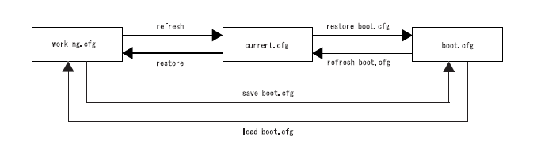

# PyATS for FITELnet

FITELnet機器をPyATSで利用するためのuniconプラグインとgenieパーサーです。

# 環境構築

これが一番悩むところです。

必要なPythonモジュールは次の４個です。

1. pyATS本体(pipでインストール)
2. FITELnet機器に接続するためのUniconプラグイン(pipでインストール)
3. FITELnet機器のコマンド出力をパースするためのGenieパーサー(どこかに配置して利用)
4. FITELnet機器の設定を生成するGenie confライブラリ(どこかに配置して利用)

2と3は本家pyATSにpullリクエストを出して取り込まれるまでの間は、利用に手間がかかります。

環境変数を使って設定しますのでdirenvも導入しておきます（超おすすめ ～ 事実上の必須レベル）。

<br>

## このリポジトリの使い方

このリポジトリをクローンします。

```bash
git clone https://github.com/takamitsu-iida/fitelnet.git
```

fitelnetディレクトリができますので、そこに移動してPython仮想環境を作ります。

```bash
cd fitelnet

python3 -m venv .venv
```

このリポジトリには.envrcが含まれています。

環境変数 `PYTHONPATH` のパスを修正します。

```
source .venv/bin/activate
unset PS1

# pyATS external genie parser
export PYTHONPATH=/home/iida/git/fitelnet/genieparser_fitelnet:$PYTHONPATH
export PYATS_LIBS_EXTERNAL_PARSER=external_parser
```

修正したら `direnv allow` コマンドで反映します。

pyatsをインストールします

```bash
pip install pyats[full]
```

としてもよいのですが、他にも利用するものがありますのでrequirements.txtでまとめてインストールします（おすすめ）。

```bash
pip install -r requirements.txt
```

これで fitelnet ディレクトリ配下にいる間はpyatsが利用できます。

続いて追加のリポジトリをクローンします。

```bash
git clone https://github.com/takamitsu-iida/genieparser_fitelnet.git
git clone https://github.com/takamitsu-iida/unicon_plugin_fitelnet.git
```

Uniconのプラグインはインストールが必要です。

```bash
cd unicon_plugin_fitelnet
make develop
```

makeコマンドがなければ次のようにsetup.pyスクリプトを実行します。

```bash
python setup.py develop --no-deps
```

インストールされているかどうかは、pip listコマンドで確認できます。

```bash
iida@FCCLS0008993-00:~/git/fitelnet$ pip list | grep unicon
unicon                       22.11
unicon-plugin-fitelnet       1.0         /home/iida/git/fitelnet/unicon_plugin_fitelnet/src
unicon.plugins               22.11
```

これでFITELnetの機器に接続できるようになります。

続いてVisual Studio Codeに設定を加えます。

追加で配置したGenieパーサーのクラス（たとえばgenieparser_fitelnet/external_parser/filtenet/show_version.py）を利用する際に、
vscodeにその存在を教えておかないと補完が効かず、開発効率が悪いためです。

vscodeの設定メニューからextra pathsを検索します。

ワークスペースに限定して、以下の設定になるようにパスを追加します。

```json
{
	"folders": [
		{
			"path": "."
		}
    ],
    "settings": {
        "python.analysis.extraPaths": [
            "genieparser_fitelnet",
            "genielibs",
        ]
    }
}```

これでvscodeの補完が効くようになります。

ワークスペースをファイル名で保存します。

次回以降は「ファイルでワークスペースを開く」を使ってワークスペースを開きます。

### 参考リンク

> External Parsers/APIs
> https://pubhub.devnetcloud.com/media/genie-docs/docs/cookbooks/parsers.html#step-by-step-guide-for-local-genie-library-implementation

> Write a parser
> https://pubhub.devnetcloud.com/media/pyats-development-guide/docs/writeparser/writeparser.html#

<br><br><br><br>

# FITELnetメモ

F220のマニュアル一式

https://www.furukawa.co.jp/fitelnet/product/f220/manual/index.html


## boot.cfgとcurrent.cfgとworking.cfg

この図を頭に入れておきます。



working.cfg = candidate-config

current.cfg = running-config

boot.cfg = startup-config

commit = refresh

discard = restore

config terminalで入るのは working.cfg = candidate-config です。これはわかる。

saveコマンドはworking.cfg = candidate-config を書き出すコマンドなので、これは要注意。running-configが保存されるわけではない。


## disconnect

残ってしまったSSHを切断する場合はこうします。

```bash
fx201-pe1#show ssh

Connection  Version  Encryption   State              Username         Line
0           1.5      none         Session initiating
1           1.5      none         Session initiating
2           2.0      AES128-CTR   Session started    user             /dev/pts/0
3           2.0      AES128-CTR   Session started    user             /dev/pts/1
4           2.0      AES128-CTR   Session started    user             /dev/pts/2

fx201-pe1#
fx201-pe1#disconnect ssh 2
Disconnect OK?[y/N]:yes

fx201-pe1#
```
