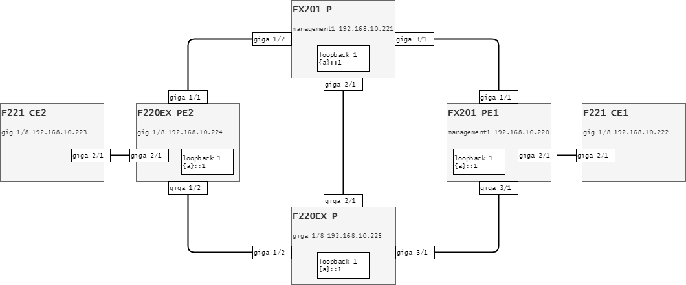
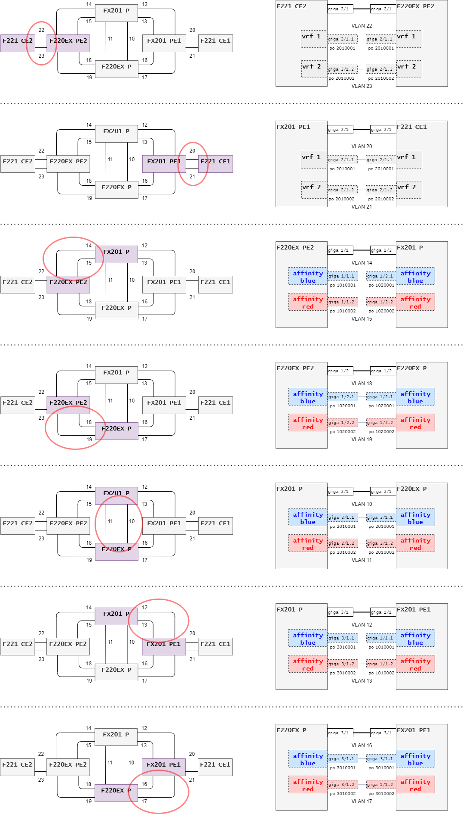
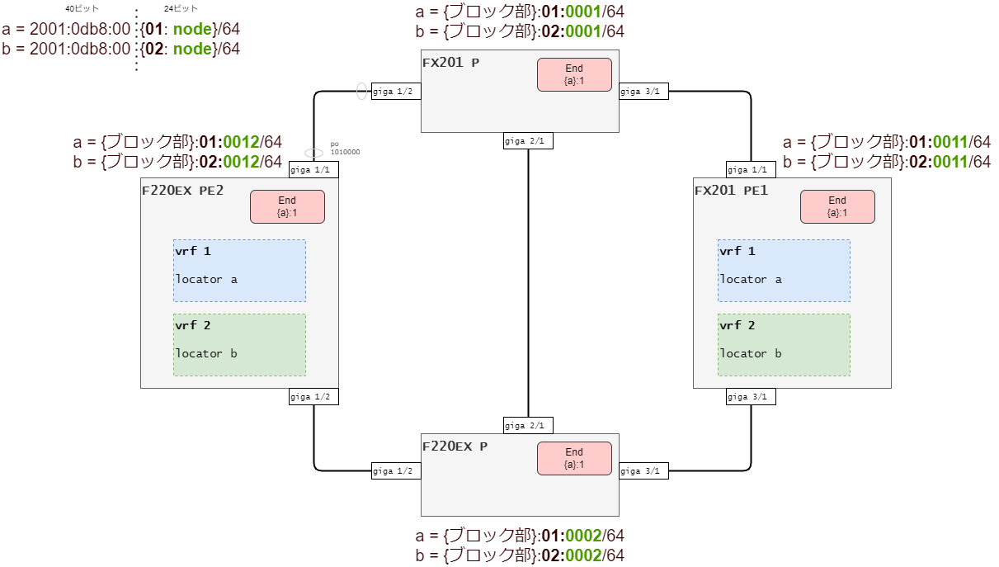
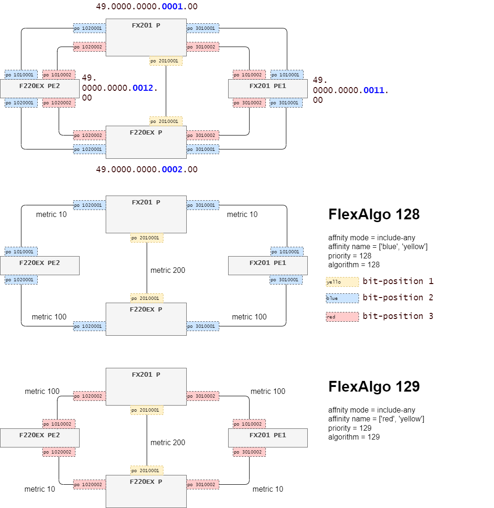
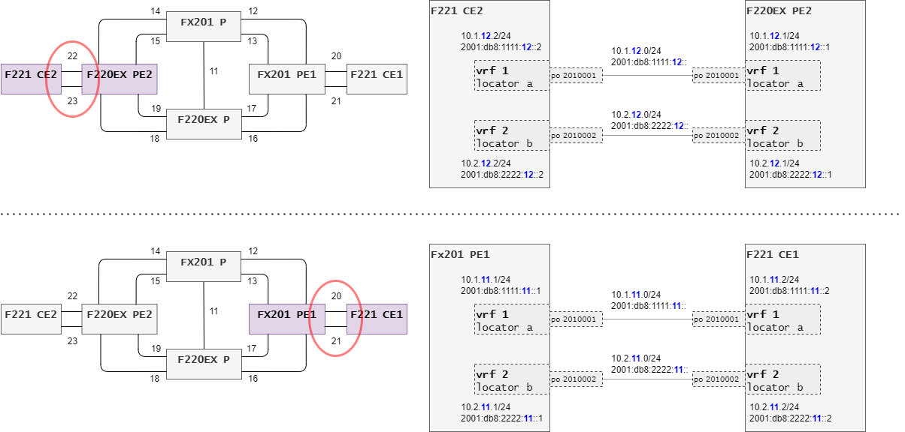

# SRv6 ISIS TE

リング型のネットワークを2個作り、それぞれのaffinityはredとblueと命名します。

Pルータ間の接続の部分はyellowと命名して、それぞれのリングで共通的に利用します。

VPNを2個作ります。

一つはredの経路、もう一つはblueの経路を通るようにします。


## 全体構成



<br><br>

## ポートチャネル設計

物理線は同じですが、論理的にネットワークを分割するためにポートチャネルを追加します。




<br><br>

## SID設計




<br><br>

## ISIS設計




<br><br>

## VPN設計




<br><br><br><br>

# 最終コンフィグ

`bin/show_current_config.py --group all --save -y`

このコマンドでexamples/logディレクトリにshow current.cfgがファイルとして保存されます。

[Pルータ・上](final_config/fx201-p_config.txt)

[Pルータ・下](final_config/f220-p_config.txt)

[PEルータ・右](final_config/fx201-pe1_config.txt)

[PEルータ・左](final_config/f220-pe2_config.txt)

[CEルータ・右](final_config/f221-ce1_config.txt)

[CEルータ・左](final_config/f221-ce2_config.txt)


<br><br><br><br>

# ログ

<br><br>

## show ip route vrf 1

```bash
f220-pe2#show ip route vrf 1

VRF: 1
Codes: K - kernel route, C - connected, S - static, R - RIP, O - OSPF,
       B - BGP, T - Tunnel, i - IS-IS, V - VRRP track,
       Iu - ISAKMP SA up, It - ISAKMP tunnel route, Ip - ISAKMP l2tpv2-ppp
       Dc - DHCP-client, L - Local Breakout
       > - selected route, * - FIB route, p - stale info

B > * 10.1.11.0/24 [200/0] via 2001:db8:1:11:42::, Tunnel1, 00:12:53
C > * 10.1.12.0/24 is directly connected, port-channel2010001
f220-pe2#show ip route vrf 2

VRF: 2
Codes: K - kernel route, C - connected, S - static, R - RIP, O - OSPF,
       B - BGP, T - Tunnel, i - IS-IS, V - VRRP track,
       Iu - ISAKMP SA up, It - ISAKMP tunnel route, Ip - ISAKMP l2tpv2-ppp
       Dc - DHCP-client, L - Local Breakout
       > - selected route, * - FIB route, p - stale info

B > * 10.2.11.0/24 [200/0] via 2001:db8:2:11:42::, Tunnel1, 00:01:53
C > * 10.2.12.0/24 is directly connected, port-channel2010002
f220-pe2#

f220-pe2#show ip route vrf 1 10.1.11.0

Routing entry for 10.1.11.0/24
  Known via "bgp", distance 200, metric 0, best, redistributed
  Encapsulation Information:
    Tunnel Type: SRv6
    Tunnel IF: Tunnel1 (Data: 0x282220)
    Tunnel ID: 229
    Tunnel Endpoint: 2001:db8:1:11:42:: (System VRF-ID: 0)
    Tunnel Parameter: (SID list)
      2001:db8:1:11:42::
  Last update 00:14:21 ago

  2001:db8:1:11:42::, Tunnel1 (Tunnel-ID:229), RD 1:1, System VRF-ID 1, NHD LINK Tunnel1 (15), refcnt 2

f220-pe2#show ip route vrf 2 10.2.11.0

Routing entry for 10.2.11.0/24
  Known via "bgp", distance 200, metric 0, best, redistributed
  Encapsulation Information:
    Tunnel Type: SRv6
    Tunnel IF: Tunnel1 (Data: 0xf6a03020)
    Tunnel ID: 229
    Tunnel Endpoint: 2001:db8:2:11:42:: (System VRF-ID: 0)
    Tunnel Parameter: (SID list)
      2001:db8:2:11:42::
  Last update 00:03:47 ago

  2001:db8:2:11:42::, Tunnel1 (Tunnel-ID:229), RD 1:2, System VRF-ID 2, NHD LINK Tunnel1 (16), refcnt 2
```

<br><br>

## show ip bgp vpnv4 all


```bash
f220-pe2#show ip bgp vpnv4 all

   Network            Next Hop            Metric     LocPrf Weight Path
Route Distinguisher: 1:1 (1)
*>i10.1.11.0/24       2001:db8:1:11::1
                                               0        100      0 ?
*> 10.1.12.0/24       0.0.0.0                  0             32768 ?
Route Distinguisher: 1:2 (2)
*>i10.2.11.0/24       2001:db8:1:11::1
                                               0        100      0 ?
*> 10.2.12.0/24       0.0.0.0                  0             32768 ?
f220-pe2#show ip bgp vpnv4 all

   Network            Next Hop            Metric     LocPrf Weight Path
Route Distinguisher: 1:1 (1)
*>i10.1.11.0/24       2001:db8:1:11::1
                                               0        100      0 ?
*> 10.1.12.0/24       0.0.0.0                  0             32768 ?
Route Distinguisher: 1:2 (2)
*>i10.2.11.0/24       2001:db8:1:11::1
                                               0        100      0 ?
*> 10.2.12.0/24       0.0.0.0                  0             32768 ?
f220-pe2#
```

```bash
f220-pe2#show ip bgp vpnv4 all 10.1.11.0

Route Distinguisher: 1:1 (1)
BGP routing table entry for 10.1.11.0/24
  Not advertised to any peer
  Local
    2001:db8:1:11::1 (metric 30) from 2001:db8:1:11::1 (192.168.255.11)
      Origin incomplete, metric 0, localpref 100, valid, internal, best, installed
      Extended Community: RT:1:1
      Original RD:1:1
      BGP Prefix-SID: SRv6 L3VPN 2001:db8:1:11:: (L:40.24, F:16.0, T:16.64) End.DT4
      Local Label: no label
      Remote Label: 1056
      Path Identifier (Remote/Local): /0
      Last update: Sun Jan  8 13:50:34 2023

f220-pe2#show ip bgp vpnv4 all 10.2.11.0

Route Distinguisher: 1:2 (2)
BGP routing table entry for 10.2.11.0/24
  Not advertised to any peer
  Local
    2001:db8:1:11::1 (metric 30) from 2001:db8:1:11::1 (192.168.255.11)
      Origin incomplete, metric 0, localpref 100, valid, internal, best, installed
      Extended Community: RT:1:2
      Original RD:1:2
      BGP Prefix-SID: SRv6 L3VPN 2001:db8:2:11:: (L:40.24, F:16.0, T:16.64) End.DT4
      Local Label: no label
      Remote Label: 1056
      Path Identifier (Remote/Local): /0
      Last update: Sun Jan  8 13:50:35 2023
```


<br><br>

## show ipv6 route

```bash
f220-pe2#show ipv6 route

Codes: K - kernel route, C - connected, S - static, R - RIPng, O - OSPFv3,
       B - BGP, T - Tunnel, i - IS-IS, V - VRRP track,
       Iu - ISAKMP SA up, It - ISAKMP tunnel route, Ip - ISAKMP l2tpv2-ppp
       Dr - DHCPv6-PD-relay, Dc - DHCP-client, Ds - DHCP-server, r - RA
       L - Local Breakout
       > - selected route, * - FIB route, p - stale info

C > * ::1/128 is directly connected, Loopback0
i > * 2001:db8:1:1::/64 [115/20] via fe80::280:bdff:fe4d:5e10, port-channel1010001, 00:05:59
i > * 2001:db8:1:1::1/128 [115/20] via fe80::280:bdff:fe4d:5e10, port-channel1010001, 00:05:59
i > * 2001:db8:1:2::/64 [115/110] via fe80::280:bdff:fe4c:b2a3, port-channel1020001, 00:05:59
i > * 2001:db8:1:2::1/128 [115/20] via fe80::280:bdff:fe4c:b2a3, port-channel1020002, 00:05:59
i > * 2001:db8:1:11::/64 [115/30] via fe80::280:bdff:fe4d:5e10, port-channel1010001, 00:05:59
i > * 2001:db8:1:11::1/128 [115/30] via fe80::280:bdff:fe4d:5e10, port-channel1010001
    *                               via fe80::280:bdff:fe4c:b2a3, port-channel1020002, 00:05:59
C > * 2001:db8:1:12::1/128 is directly connected, Loopback1
i > * 2001:db8:2:1::/64 [115/110] via fe80::280:bdff:fe4d:5e10, port-channel1010002, 00:05:59
i > * 2001:db8:2:2::/64 [115/20] via fe80::280:bdff:fe4c:b2a3, port-channel1020002, 00:05:59
i > * 2001:db8:2:11::/64 [115/30] via fe80::280:bdff:fe4c:b2a3, port-channel1020002, 00:05:59
C > * fe80::/64 is directly connected, port-channel1010001
C > * fe80::/64 is directly connected, port-channel1010002
C > * fe80::/64 is directly connected, port-channel1020001
C > * fe80::/64 is directly connected, port-channel1020002
```

<br><br>

## show isis flex-algo

ビットポジションの設定はこのようにしています。

```bash
router isis core
 affinity-map yellow bit-position 1
 affinity-map blue bit-position 2
 affinity-map red bit-position 3
```

yellow(ビットポジション1)とblue(ビットポジション2)をorすると、`0b0110`なので16進数だと0x6です。

yellow(ビットポジション1)とred(ビットポジション3)をorすると、`0b1010`なので16進数だと0xaです。

下記のDefinition Include-Anyの行がそれを意味しているのですが、0を書き並べる意味が分かりません。

（2進数で表示しようとして、間違って16進数で表示してしまっているバグじゃないかしら？）

```bash
f220-pe2#show isis flex-algo

Area core:
Flex-Algo 128:
       Definition Priority: 128
       Definition Source: 0000.0000.0012
       Definition Metric Type: IGP Metric
       Definition Calc Type: SPF
       Definition Include-Any: 00000000 00000000 00000000 00000000 00000000 00000000 00000000 00000006
       Disabled: No

Flex-Algo 129:
       Definition Priority: 129
       Definition Source: 0000.0000.0012
       Definition Metric Type: IGP Metric
       Definition Calc Type: SPF
       Definition Include-Any: 00000000 00000000 00000000 00000000 00000000 00000000 00000000 0000000a
       Disabled: No
```
