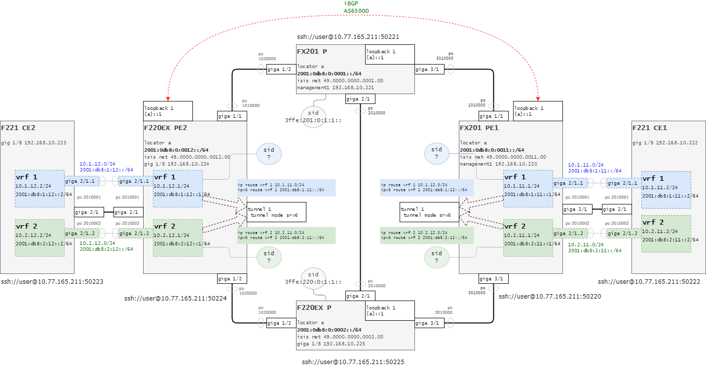
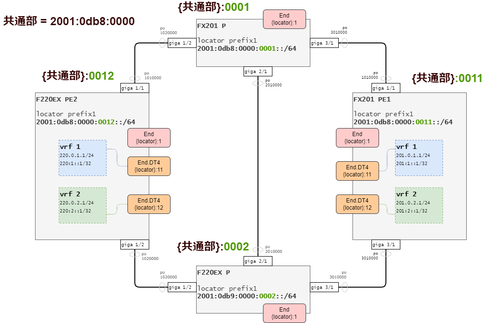

# SRv6 ISIS TE

## 全体構成

  

[FX201 P](ssh://iida@10.77.165.211:50221) Pルータ 上

[F220 EX P](ssh://iida@10.77.165.211:50225) Pルータ 下

[FX201 PE1](ssh://iida@10.77.165.211:50220) PEルータ 右

[F220 EX PE2](ssh://iida@10.77.165.211:50224) PEルータ 左

[F221 CE1](ssh://iida@10.77.165.211:50222) CEルータ 右

[F221 CE2](ssh://iida@10.77.165.211:50223) CEルータ 左

  

## ローカルSID設計

採番ルール

- End `{locator}:1` = Loopback 1のIPv6アドレス
- vrf 1 End.DT4 `{locator}:11`
- vrf 2 End.DT4 `{locator}:12`
